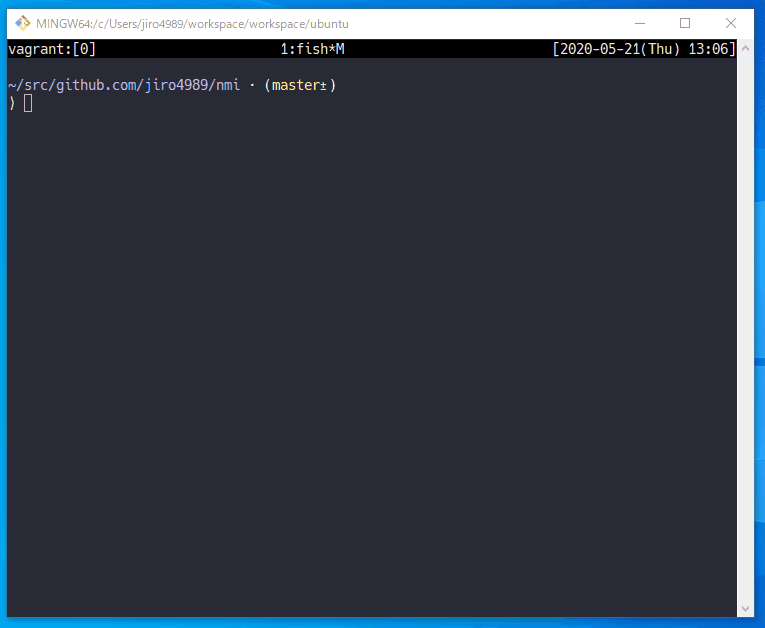
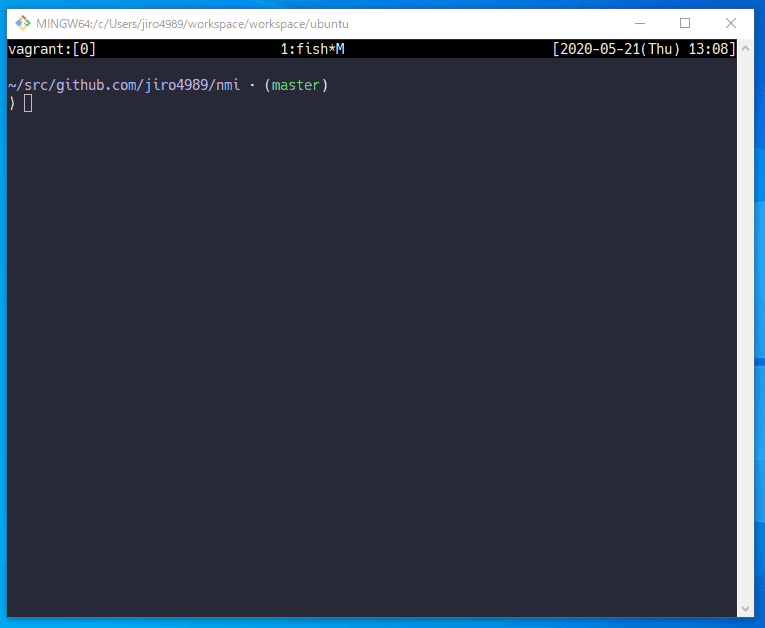

====
nmi
====

|nimble-version| |nimble-install| |gh-actions|

nmi display animations aimed to correct users who accidentally enter nmi instead of nim.

|demo_1|

|demo_2|

.. contents:: Table of contents

Usage
=====

.. code-block:: shell

   $ nmi
   $ nmi -c

Installation
============

.. code-block:: shell

   $ nimble install -Y nmi

LICENSE
=======

MIT

.. |gh-actions| image:: https://github.com/jiro4989/nmi/workflows/build/badge.svg
   :target: https://github.com/jiro4989/nmi/actions
.. |nimble-version| image:: https://nimble.directory/ci/badges/nmi/version.svg
   :target: https://nimble.directory/ci/badges/nmi/nimdevel/output.html
.. |nimble-install| image:: https://nimble.directory/ci/badges/nmi/nimdevel/status.svg
   :target: https://nimble.directory/ci/badges/nmi/nimdevel/output.html

